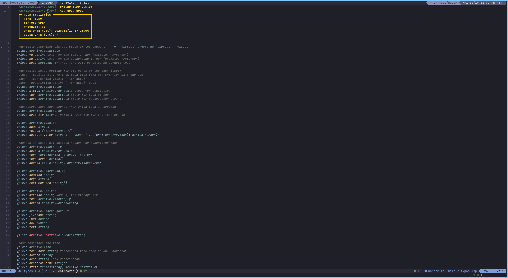
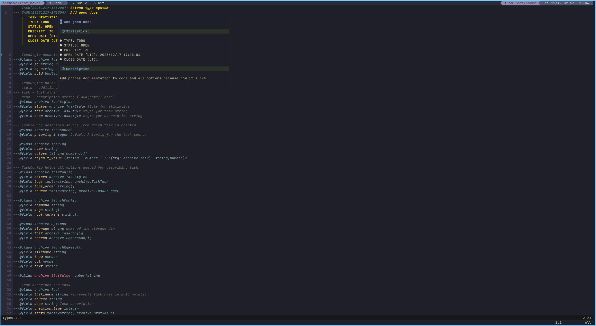
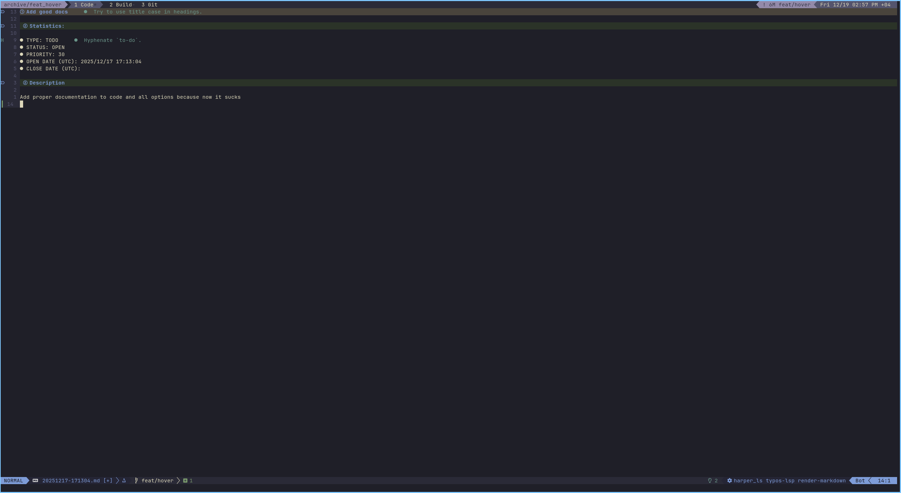

# Archive.nvim







## Description

This plugin was inspired by [Tsdoing](https://github.com/tsoding) and his stream session where he was developing `emacs` plugin.

Main purpose of this plugin is local storage for tasks inside project. You can think of it like **GitHub** issues

> [!WARNING]
> This plugin is in early development stage in case of any issues please make one

## Features

- **highlight** your tasks in different styles
- go to task
- create task from [folke's todo](https://github.com/folke/todo-comments.nvim)
- virtual lines for task statistics
- hover on task to see it
- tasks picker with [Snacks](https://github.com/folke/snacks.nvim)

## Requirements

- [ripgrep](https://github.com/BurntSushi/ripgrep)

> [!WARNING]
> I've not tested compability so for now it work on the neovim from **Arch** repos


## Instaltion 

### [lazy.nvim](https://github.com/folke/lazy.nvim)

```lua
{
  "Old-est/archive.nvim",
  opts = {
    -- your configuration comes here
    -- or leave it empty to use the default settings
  }
  keys = {
    -- you should set keybinds by yoursel at this point
  }
}
```

## Configuration

`Archive.nvim` comes with the following defaults

```lua
{
  storage = "tasks",

  task = {
    icon = " ",
    colors = {
      status = { fg = "#ffd700", bg = "none", bold = true },
      task = { fg = "#52796f", bg = "none", bold = true },
      desc = { fg = "#ffd700", bg = "none", bold = true },
    },

    tags = {
      type = { name = "TYPE", default_value = M.get_type },
      status = { name = "STATUS", values = { "OPEN", "DONE", "INPROGRESS", "PAUSED" }, default_value = "OPEN" },
      priority = { name = "PRIORITY", default_value = M.get_priority },
      creation_date = { name = "OPEN DATE (UTC)", default_value = M.get_creation_time },
      close_date = { name = "CLOSE DATE (UTC)" },
    },

    tags_order = { "type", "status", "priority", "creation_date", "close_date" },

    source = {
      TODO = { priority = 30 },
      BUG = { priority = 50 },
      FIX = { priority = 40 },
    },
  },

  search = {
    command = "rg",
    args = { "--color=never", "--no-heading", "--with-filename", "--line-number", "--column" },
    root_markers = { ".git", "stylua.toml" },
  },
}
```

### Keybinds
